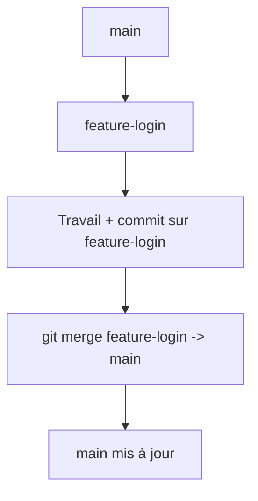
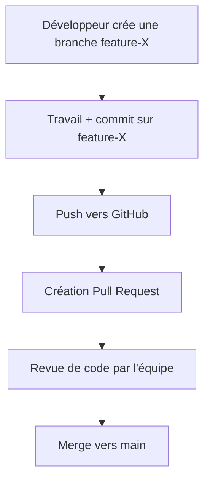

### **1. Qu'est-ce que Git ?**

**Git** est un **système de contrôle de version décentralisé** utilisé principalement dans le développement logiciel. Il permet à plusieurs personnes de **travailler simultanément sur le même projet** sans écraser le travail des autres.

#### Objectifs principaux de Git :

* Suivre **l’historique complet des modifications** sur un projet.
* Travailler en équipe sur le **même code source**, de façon **structurée et sécurisée**.
* Permettre de **revenir à une version antérieure** du projet en cas d’erreur.
* Favoriser une **expérimentation sûre** grâce à la gestion des **branches**.

#### Fonctionnement de base :

* Le projet est initialisé avec `git init`.
* Les changements sont ajoutés avec `git add`.
* Ils sont enregistrés avec `git commit`.
* On peut partager le code avec `git push` et récupérer celui des autres avec `git pull`.

#### Avantage majeur :

Chaque développeur possède une **copie complète du projet**, avec tout l'historique. Cela rend Git très fiable, même en cas de déconnexion ou de perte de données sur un serveur.

---

### **2. Qu'est-ce que Docker ?**

**Docker** est une **plateforme de virtualisation légère** qui permet de créer, exécuter et déployer des applications dans des **conteneurs**.

#### Objectifs principaux de Docker :

* **Isoler les applications** dans des environnements reproductibles.
* Éviter les problèmes du type "ça marche sur mon ordinateur mais pas sur le serveur".
* **Standardiser le déploiement** des applications, quel que soit le système d'exploitation hôte.

#### Fonctionnement de base :

* On décrit un environnement dans un fichier `Dockerfile`.
* On construit une **image Docker** avec `docker build`.
* On exécute l’application dans un **conteneur** avec `docker run`.

#### Différence avec une machine virtuelle :

Contrairement aux machines virtuelles, les conteneurs **partagent le noyau du système hôte**. Ils sont donc plus légers, plus rapides à démarrer, et consomment moins de ressources.


# Annexe 1

### **Schéma 1 — Flux de travail simple avec Git (développeur solo ou petit projet)**

```mermaid
graph TD
    A[Développeur local] -->|git init / git add / git commit| B[Repository local]
    B -->|git push| C[Repository distant (GitHub)]
    C -->|git pull| A
```


### **Schéma 2 — Collaboration entre plusieurs développeurs avec un dépôt distant**

```mermaid
graph TD
    subgraph Développeur A
        A1[Clone dépôt distant]
        A2[Travail local + commit]
        A3[git push]
    end

    subgraph Développeur B
        B1[Clone dépôt distant]
        B2[Travail local + commit]
        B3[git pull / git merge]
        B4[git push]
    end

    R[Repository distant (GitHub)]

    A1 --> A2 --> A3 --> R
    B1 --> B2 --> B3 --> B4 --> R
    R --> B3
```


### **Schéma 3 — Utilisation des branches dans Git**




### **Schéma 4 — Revue de code avec Pull Request**




